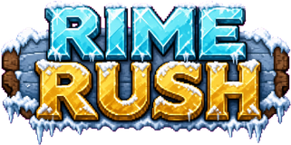
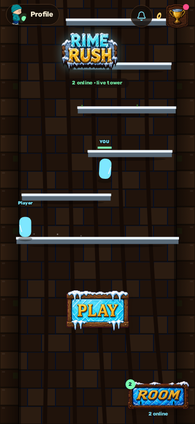
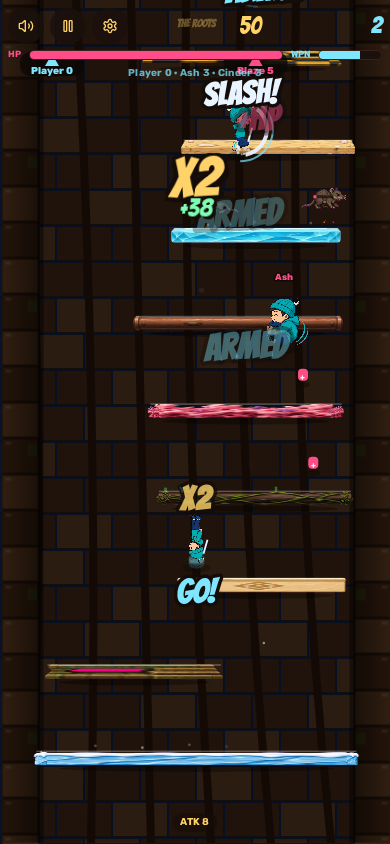
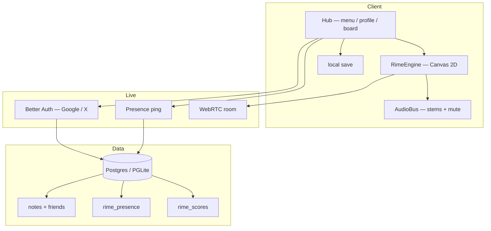

<p align="center">
  
</p>

<p align="center">
  <strong>Endless ice-tower climber.</strong> Run. Jump. Don't stop.<br/>
  קומבו על הקרח · RIME נגד EMBER · טיפוס שלא נגמר
</p>

<p align="center">
  
  
  
</p>

<p align="center">
  <a href="#מה-זה"><strong>מה זה</strong></a> ·
  <a href="#למה"><strong>למה</strong></a> ·
  <a href="#איך-משחקים"><strong>איך משחקים</strong></a> ·
  <a href="#איך-זה-עובד"><strong>איך זה עובד</strong></a> ·
  <a href="#הרצה-מקומית"><strong>הרצה</strong></a> ·
  <a href="docs/PRD.md"><strong>PRD</strong></a>
</p>

---

<p align="center">
  
  
</p>

## מה זה

**RIME RUSH** הוא משחק טיפוס אנכי אינסופי (endless climber) בסגנון ארקייד.

אתה קופץ ממדרגה למדרגה במגדל קרח. כל קפיצה ברצף בונה **קומבו**. הקומבו מאיץ אותך, מחליף את המוזיקה, ומעלה את הניקוד. נופלים — מפסידים. ממשיכים — עולים.

יש יריבים חיים על המגדל (שחקנים אחרים + בוטים של EMBER), אויבים שצדים אותך, נשקים, פאואר-אפים, ולוח שיאים.

| | |
|---|---|
| ז'אנר | Endless vertical climber / arcade |
| פלטפורמה | מובייל + דסקטופ (PWA) |
| שחקן | סולו עכשיו · חדרים + נוכחות חיה |
| סיפור | **RIME** (קרח) נגד **EMBER** (אש) |

מסמך המוצר המלא: [`docs/PRD.md`](docs/PRD.md)

---

## למה

רוב משחקי הריצה מרגישים כמו כפתורים על מסך. רצינו **ארקייד**:

- מדרגות עם 30 סגנונות, לא מלבן כחול אחד
- מוזיקה שמתחממת עם הקומבו, לא לופ שטוח
- יריבים שצדים, לא ספרייטים שבורחים
- פרופיל אמיתי (Google / X), התנתקות, מחיקה
- תפריט של שלטי עץ וקרח — לא UI של אפליקציה

המטרה: משחק שמרגיש חי בטלפון, שאפשר לפתוח לעשרים שניות או לעשרים קומות.

---

## איך משחקים

1. פותחים את התפריט → לוחצים **PLAY** (או Space / הקשה בכל המסך).
2. רצים ימינה/שמאלה. קופצים. לא עוצרים.
3. כל נחיתה ברצף = קומבו. קומבו גבוה = יותר מהירות, יותר ניקוד, מוזיקה חמה יותר.
4. אויבים (חולדות, עטלפים, פולשי EMBER) צדים. יורים / חותכים / מתחמקים.
5. נופלים מתחת למצלמה → CONTINUE קצר או סוף ריצה.
6. השיא עולה ללוח. אפשר להיכנס לחדר (`ROOM`) עם חברים.

### שליטה

| | מובייל | מקלדת |
|---|---|---|
| תנועה | החלקה / מקשי צד | `←` `→` / `A` `D` |
| קפיצה | TAP / כפתור קפיצה | `Space` / `↑` / `W` |
| נשק | כפתור ATK | `J` / `K` |
| השהיה | Pause | `Esc` |

סאונד ושייק נשלטים מההשהיה — שלטי ארקייד, לא טוגלים אפורים.

---

## איך זה עובד



### למה כך

| החלטה | למה |
|---|---|
| **Canvas 2D + fixed 60Hz** | פיזיקה זהה בכל מכשיר. בלי פיצול Phaser/Unity. |
| **React רק למעטפת** | התפריט, הפרופיל, הלוח. הלולאה עצמה מחוץ ל-React כדי שלא ייקרס מ-HMR. |
| **Atlas אחד ל-30 מדרגות** | במקום 30 קבצים בטעינה — קובץ אחד, 9-slice, אפקט לכל סגנון. |
| **מוזיקה ב-stems** | lobby / climb / heat / rush מתערבבים לפי קומבו. מיute משתיק הכל. |
| **PGLite → Neon** | בלי `DATABASE_URL` המשחק רץ לבד. עם URL — לוח אונליין אמיתי. |
| **Presence ולא MMO** | כרגע מגדל חי (ghosts) + חדר P2P. שרת 50 שחקנים עם קבוצות — ב-roadmap. |

### תיקיות חשובות

```
src/game/          מנוע, פיזיקה, ציור, אודיו, עולם
src/components/    תפריט, פרופיל, לוח, HUD
src/lib/           auth, db, presence, P2P
src/routes/        TanStack Start
public/ledges/     atlas של 30 מדרגות
public/sprites/    hopper + סקינים
public/enemies/    rat / bat / ember / raider
public/music/      4 stems מ-Pixabay
migrations/        סכימת Postgres
docs/PRD.md        מסמך המוצר
```

---

## הרצה מקומית

```bash
git clone https://github.com/rept0rix/rime-rush.git
cd rime-rush
npm install
npm run dev          # http://localhost:8080
```

בלי משתני סביבה זה רץ על **PGLite** (Postgres ב-WASM). ללוח משותף:

```bash
cp .env.example .env
# מלא DATABASE_URL ל-Neon / Postgres
```

פקודות:

| פקודה | |
|---|---|
| `npm run dev` | שרת פיתוח |
| `npm run typecheck` | TypeScript |
| `npm test` | בדיקות סקריפטים + auth |
| `npm run build` | בילד לפריסה |

---

## סטאק

- **UI** — React 19, TanStack Start / Router, Tailwind 4
- **Game** — Canvas 2D, fixed timestep, Sprite atlas
- **State** — Zustand + localStorage
- **Auth** — Better Auth (Google, X)
- **DB** — PGLite locally, Postgres (Neon) in prod
- **Live** — presence ping + WebRTC rooms
- **PWA** — add to home screen

---

## מצב עכשיו / לאן

**חי עכשיו**
- ריצת סולו אינסופית עם קומבו
- 30 סגנונות מדרגות + אויבים ציידים
- מוזיקה לפי חום, השתקה, שייק
- פרופיל, התנתקות, מחיקת חשבון
- לוח שיאים, נוכחות חיה, חדר P2P

**בדרך** — ראה [`docs/PRD.md`](docs/PRD.md)
- שרת ייעודי ל-50 שחקנים במקביל
- קבוצות RIME / EMBER
- פחות עומס HUD, יותר juice

---

## קרדיטים

- מוזיקה: [Pixabay gaming](https://pixabay.com/music/search/gaming/) — ראה `public/music/CREDITS.txt`
- השראת רקעים / טילסטים: [CraftPix freebies](https://craftpix.net/freebies/filter/game-backgrounds/) — ראה `public/ledges/CREDITS.txt`

---

<p align="center">
  <sub>RIME holds the tower. EMBER wants the fire back.</sub>
</p>
